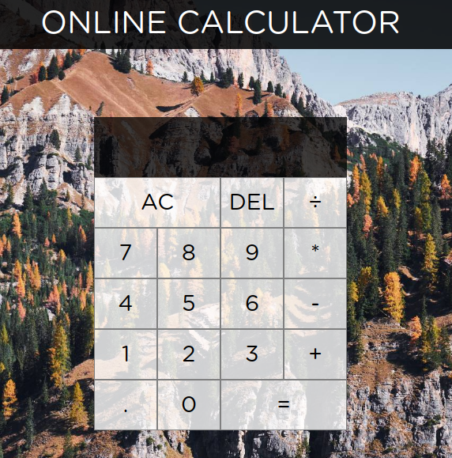

# Online Calculator App

## About

 This is my small project to get to know Javascript and improve my CSS skills by building this basic calculator.
 It needs some improvements, like:
 - To have a display limit on how big numbers can the user select.
 - To add the ability, to change operations in the middle of another one (before you add the second operand).
 - To add more operations and functions.

This is web app is build with vanilla Javascript and HTML/CSS, inspired by a tutorial.
